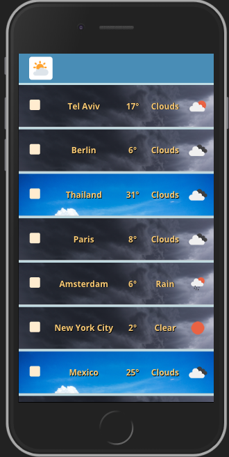

# Weather-App

Weather-App is a front-end app built with React. 

The app allows you to get weather information of 10 different cities.

The user can click on the checkbox of each city and the "Refresh" button to get an updated information of the selected cities.

Weather info provided by OpenWeatherMap(https://openweathermap.org/)

Demo: [http://rons-react-weather-app.herokuapp.com/](http://rons-react-weather-app.herokuapp.com/)

## Table Of Contents
- [Weather-App](#weather-app)
  - [Table Of Contents](#table-of-contents)
  - [Running the project](#running-the-project)
  - [Screenshots](#screenshots)
  - [Tech-stack](#tech-stack)

## Running the project

1. Create an account in OpenWeatherMap, then navigate to https://home.openweathermap.org/api_keys and create an api_key
2. Clone the repo.
3. Run `npm install`.
4. create `.env` file on root folder with the following: REACT_APP_API_KEY=YOUR_API_KEY
5. Run `npm run build`
6. Run `npm start`.
7. Navigate to `http://localhost:5000`.

## Screenshots

## Tech-stack
1. React
2. Redux
3. Redux-Saga
4. Axios